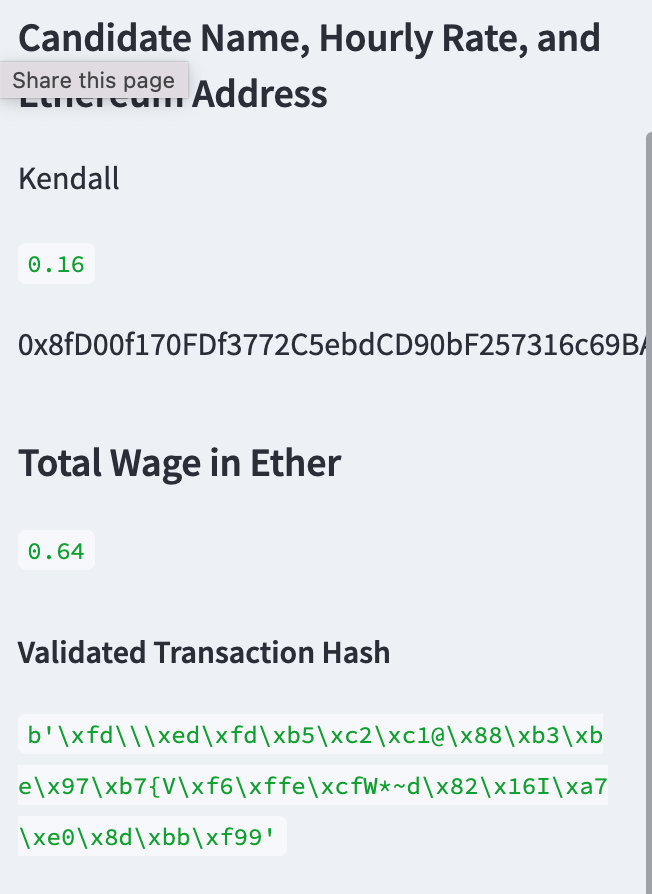
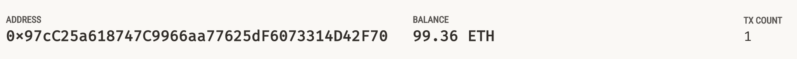
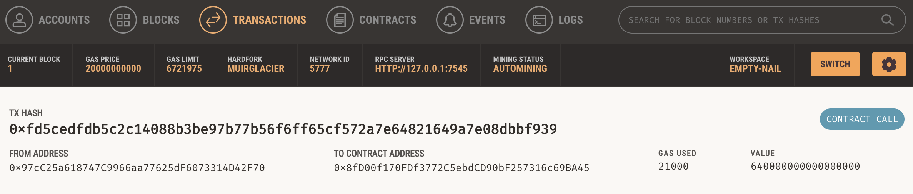

# Challenge19
## Overview
This challenge integrates the Ethereum blockchain network into the an application called, Fintech Finder, in order to enable customers to instantly pay the fintech professionals whom they hire with cryptocurrency.

## The Results

The crypto_wallet functions were imported into the fintech_finder.py file. Within the fintech_finder file, the imported funtions were called and modified to incorporate account, balance, and wage variables set in this file. Streamlit was used to create the web interface. Pictures of the validated transaction on the web interface and validation via Gnache are below:

User Interface Validation

Gnache Account

Gnache Transaction

## Summary
The fintech_finder app was successfully changed to run on functions from the crypto_wallet file, giving the end user the functionality to select a fintech professional and determine if he/she could afford the chosen professional. This was validated on a web interface using streamlit.